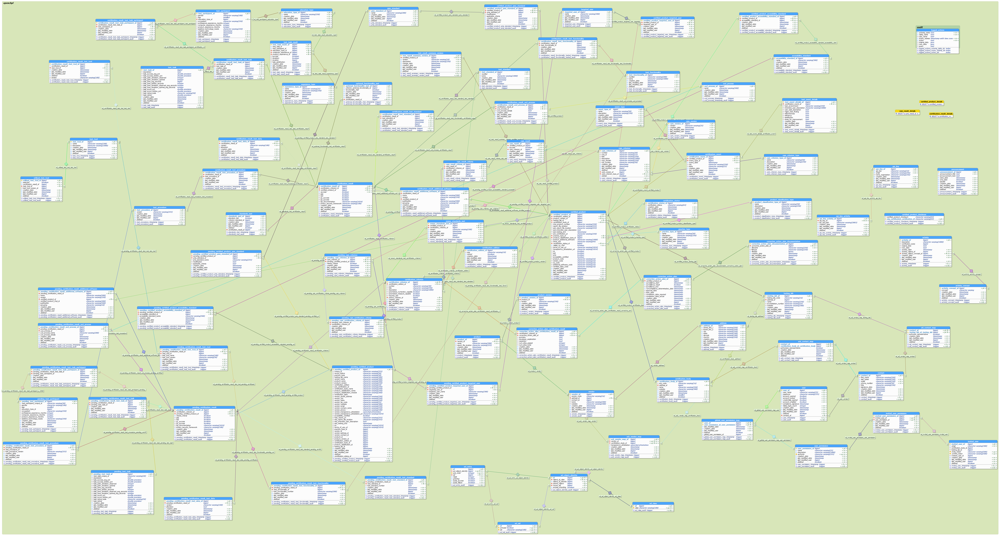
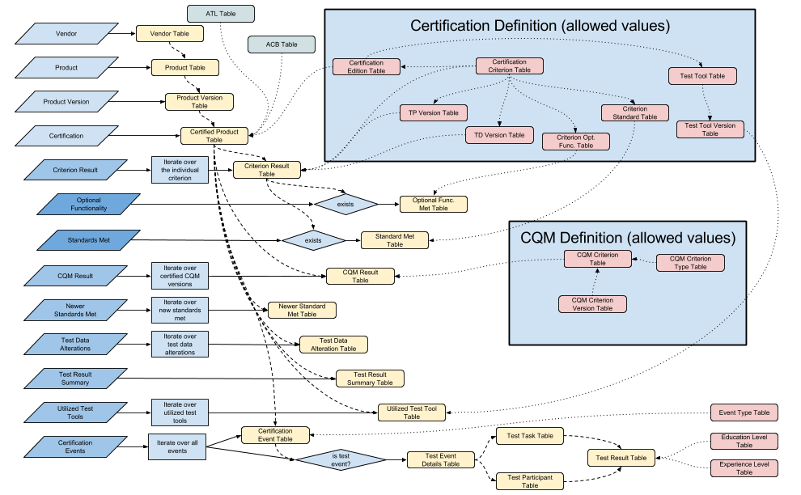

# Data Model for Open Data CHPL

This is the Data Model for the Open Data CHPL.

The data model diagram is such: 

The data flow diagram is here: 

# Installation

## Getting the code

```sh
$ git clone https://github.com/andlar/chpl-api.git
$ cd openchpl-sql
```

## Data model load

Edit `openchpl-role.sql` to set the password for the `openchpl` role. These instructions assume the role/username used for the openchpl database is `openchpl`, and that the password in `openchpl-role.sql`, currently recorded as "change this password" will be update to match your installation. If the installer chooses to change the username/role, make sure it's also changed in the `openchpl.sql` file wherever the role is used.

```sh
$ psql -Upostgres -f chpl-api/openchpl-sql/openchpl-role.sql
$ psql -Upostgres -f chpl-api/openchpl-sql/openchpl.sql
$ psql -Upostgres -f chpl-api/openchpl-sql/audit-openchpl.sql
$ psql -Upostgres -f chpl-api/openchpl-sql/preload-openchpl.sql
```

# Resetting

If you want to reset the database, without deleting the actual tables, you'll need to truncate three tables. If, instead, you want to completely drop the database to rebuild it from scratch, you'll need to drop two schemas, and one role.

## To truncate the tables

```sh
$ psql
postgres=# truncate table openchpl.certified_product_checksum;
postgres=# truncate table openchpl.vendor cascade;
postgres=# truncate table audit.logged_actions cascade;
postgres=# \q
```

## To completely remove the databases

```sh
$ psql
postgres=# drop schema audit cascade;
postgres=# drop schema openchpl cascade;
postgres=# drop role openchpl;
postgres=# \q
```
